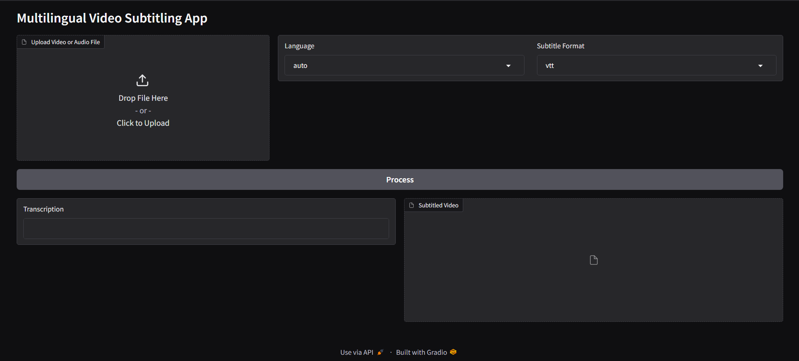

# Multilingual Video Transcriber/Subtitler

## Overview

A Python-based Jupyter notebook project that transcribes audio and video files into text, detects the spoken language, generates subtitles in multiple formats, and overlays them onto the video using Gradio for the frontend and Whisper for transcription.

## Features

- Transcribes audio and video files into text.
- Detects the spoken language automatically or based on user selection.
- Generates subtitles in VTT and SRT formats.
- Overlays subtitles onto video files.
- User-friendly interface via Gradio within a Jupyter notebook.
- Supports multiple languages.

## Installation

1. **Clone the Repository**

   ```bash
   git clone https://github.com/Chungus1310/Multilingual-Video-Transcriber.git
   ```

2. **Create a Virtual Environment (Optional but Recommended)**

   ```bash
   python -m venv env
   source env/bin/activate  # On Windows: env\Scripts\activate
   ```

3. **Install Required Libraries**

   ```bash
   pip install -r requirements.txt
   ```

4. **Ensure ffmpeg is Installed**

   - **Linux**: `sudo apt-get install ffmpeg`
   - **macOS**: `brew install ffmpeg`
   - **Windows**: Download from [ffmpeg official website](https://ffmpeg.org/download.html) and add to PATH.

## Usage

1. **Open the Jupyter Notebook**

   ```bash
   jupyter notebook transcriber.ipynb
   ```

2. **Run the Cells**

   - Execute the cells in order to set up the environment and load the model.
   - When prompted, install any missing dependencies directly within the notebook.

3. **Use the Gradio Interface**

   - Follow the instructions in the notebook to launch the Gradio app.
   - Use the interface to upload files, select language, and process transcription.
   - Note: For external access, you may need to use a tunneling service like ngrok.

## Dependencies

- Python 3.10 or higher
- Jupyter Notebook or JupyterLab
- Gradio
- Whisper
- MoviePy (for video processing)
- ffmpeg

## Contributing

- **Report Issues**: Open an issue on GitHub.
- **Contribute Code**: Fork the repository, make changes, and submit a pull request.
- **Code of Conduct**: Adhere to the [Contributor Covenant](https://www.contributor-covenant.org/).


## Contact

For questions or collaboration opportunities, don't contact me, instead feel free to fork it.

## Screenshots



## Future Enhancements

- Support for additional subtitle formats.
- Real-time transcription updates.
- Improved subtitle timing accuracy.

---
